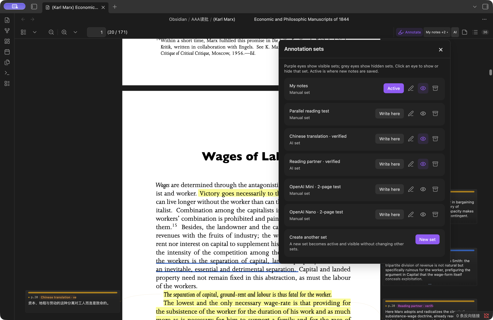
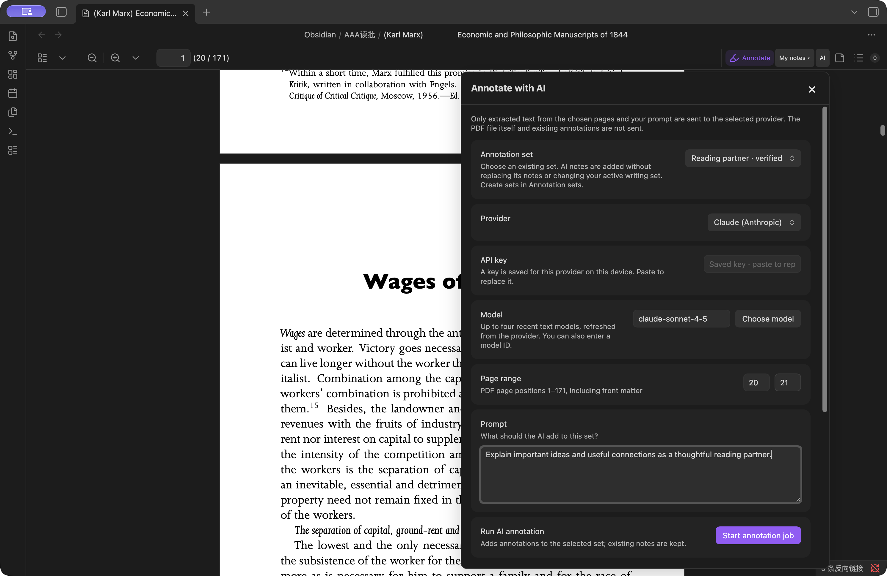

# PDF Annotator

Read a PDF, mark the parts that matter, and keep your own thoughts beside the
words — all inside Obsidian.

Open any PDF and click **Annotate**. You can highlight a sentence, write a note,
and carry on reading without changing apps or opening a second document.


*Your notes stay close to the words they belong to.*

## See every note beside the page

Notes appear on the left or right of the page. A short note stays small. A long
note is taller, so you can tell how much you wrote before opening it.

When one page has many long notes, the cards fold just enough to share the
space. A soft fade and **…** show that more words are waiting. Point to a card or
click it to see the whole note.


*Different note lengths are easy to spot, and folded notes clearly show that
there is more to read.*

You do not need to guess how to make room for the cards. After you make a note,
or choose one from the note list, the PDF moves back just enough to show its
card. It stops as soon as the card has enough space.

## Mark what matters

Select some words and choose what you want to do:

- **Highlight** marks the words.
- **Annotate** marks the words and opens a place to write.
- **Copy** copies the selected words.


You can use a plain highlight, underline, dotted underline, dashed underline,
box, or strike-through. Four colours help different kinds of thought stand
apart.

## Open one note fully

Point to a note or click it and the card opens to show everything you wrote. A
long note is not cut off. Click the pin when you want a card to stay open.


*The selected note opens fully while the other cards stay out of the way.*

## Find a note again

Click the list button beside **Annotate** to see every mark and note in the PDF.
Search for a word, a page, or something you wrote. Click any result to go back
to its page and show its card.


## Put notes where you want them

Right-click any card to keep it open, move it to the left, move it to the right,
let PDF Annotator choose a side, or delete it.


*Moving a card never moves or changes the words you marked.*

## A simple reading routine

1. Open a PDF and click **Annotate**.
2. Select a useful sentence.
3. Choose **Highlight** or **Annotate**.
4. Write your thought.
5. Keep reading; your note stays beside the page.
6. Use the list when you want to find it again.

## Take your quotes and notes with you

Run **Export annotations for current PDF** from Obsidian's command palette.
The exported Markdown keeps the full highlighted passage, its colour, and your
note underneath it. Each non-archived set gets its own heading—even sets you
have hidden while reading. No extra export options to configure.

## Keep different kinds of notes separate

Think of annotation sets as separate notebooks laid over the same PDF. Keep
your own thoughts in **My notes**, translations in another set, and explanations
in a **Reading partner** set. Show them together, or hide the ones you do not
need right now. Nothing is erased when you hide a set.

Click the set name at the top right to open the dropdown:

- A **purple eye** means that set is visible. Click it to hide the set; click a
  grey eye to show it again.
- **Write here** chooses where your next manual notes will go. That set then
  says **Active**. Other sets can still be visible at the same time.
- **New set** gives you another space for a different purpose.



*Choose what you see independently from where you write.*

## Invite AI to read alongside you

You can do your own thinking and still ask for a little help. For example, keep
your notes untouched while AI adds a translation or explains an unfamiliar
idea in a separate set.

1. Create a set in the set dropdown, such as **Translation** or **Reading partner**.
2. Click **AI** at the top right and choose that existing set.
3. Choose your provider, paste its API key, and choose a model.
4. Pick a few pages and describe the help you want. For example: “Translate key
   passages into Chinese” or “Explain unfamiliar ideas and useful connections.”
5. Start the job and keep reading. Progress appears on the toolbar, and closing
   the dropdown does not stop the work.



*Tell AI what kind of help you want and where its notes should go.*

AI adds notes to the set you choose; it does not replace your existing notes or
change where your manual notes are saved. Page numbers are positions in the PDF,
including any cover or introduction. Start with two pages to see whether the
result suits you. AI explanations can be wrong, so treat them as suggestions.

The model picker stays short: up to four recent text models from your provider.
You can refresh the choices or enter a model ID yourself when a new one appears.
There is no request format or code to configure.

AI is optional and uses your own provider account, which may charge for requests.
Only text from your chosen pages and your prompt are sent—not the whole PDF or
your existing annotations. The API key stays outside your vault on this device;
that storage is not encrypted. See [Privacy](#privacy) for the details.

---

## Technical Notes

PDF Annotator is a desktop-only Obsidian community plugin. It adds annotation
layers, controls, margin rails, and an annotation list to Obsidian's native PDF
viewer. Obsidian's existing toolbar, outline/sidebar, zoom controls, and page
navigation remain in place.

Selection alone does not create an annotation. The selection popover commits a
highlight or annotated mark only after the user chooses an action. Highlight
geometry is stored in PDF user-space coordinates, so marks stay anchored across
zoom and resize changes.

### Automatic rail space

Creating an annotation or selecting one from the annotation list activates its
card. If the native PDF page leaves too little readable margin, the plugin uses
the native zoom-out control until that card's rail is wide enough. It stops as
soon as the target rail is readable and has a bounded retry limit.

Resting card height is weighted mainly by user-written content. On a dense page,
the available rail height is shared proportionally: longer cards remain visibly
longer, while all resting cards fold enough to fit. Hovered, active, and pinned
cards expand to their full content height, with an internal scrollbar only when
the entire card is taller than the available viewport.

### Native PDF workflow

1. Open a PDF normally in Obsidian.
2. Click **Annotate** in the native PDF toolbar.
3. Select text and choose **Highlight**, **Annotate**, or **Copy**.
4. Click an existing mark to edit its style, colour, note, or side note.
5. Use a side card for in-place editing, or the annotation list for search and
   navigation.

The card context menu supports pin/unpin, left placement, right placement,
automatic placement, and deletion. Drag-and-drop between rails is not currently
implemented.

## Fallback Annotator View

The original bundled `pdf.js` annotator view remains available as a stable
fallback. Use the command palette action:

```text
Open current PDF in annotator
```

You can also make the fallback annotator the default PDF viewer from plugin
settings. This redirects ordinary `.pdf` clicks into PDF Annotator. The setting
is opt-in for fresh installs.

## Storage and Recovery

The visible PDF path is not the document identity. Identity comes from a SHA-256
hash of the PDF bytes, and the canonical vault-local bundle is stored at:

```text
.pdf-annotator/bundles/sha256/<hash>/
  document.pdf
  annotations.md
  annotations.previous.md
  annotation-sets/
    index.json
    index.previous.json
    default.md
    <set-id>.md
    <set-id>.previous.md
  ai-jobs/
    <job-id>.json
    <job-id>.previous.json
  manifest.json
```

`document.pdf` is a verified byte-for-byte recovery copy. Existing
`annotations.md` data is preserved and migrated into the default annotation
set. Each set then has its own readable Markdown sidecar and rolling
last-known-good copy. `annotation-sets/index.json` records set names, kinds,
visibility, and the active write target. AI job checkpoints record progress and
provider/model provenance, but never the API key.
Open tabs share the same workspace, and saves are serialized. A damaged set
registry is preserved for inspection, recovered from its backup, and reconciled
with surviving annotation sidecars so newer sets remain accessible.
`manifest.json` records the current working path, previous path aliases,
checksum, original filename, timestamps, and PDF fingerprint. The working PDF
is never modified.

The bundle is created the first time annotation mode opens for that PDF. This
uses roughly one additional PDF's worth of vault storage in exchange for
deletion recovery.

Moving or renaming a working PDF does not move the bundle and cannot disconnect
its annotations. Replacing a PDF with different bytes at the same path creates a
different bundle, so annotations cannot silently attach to the wrong document.
Deleting the working copy leaves the bundle intact. Use **Restore a PDF from
annotation backup** in the command palette to verify the checksum and restore a
copy into `Recovered PDFs/`.

Existing central or same-folder `<pdf-name>.annotations.md` sidecars are
imported on first open. A unique PDF-fingerprint match can also recover a
sidecar that was already orphaned by a rename. Legacy files are retained as
recovery snapshots.

The canonical sidecar contains a readable Markdown summary and a fenced JSON
block that is used as the machine-readable source of truth. Use **Export
annotations for current PDF** to create a user-visible snapshot under
`PDF annotations/Exports/` (or the configured legacy annotation folder).
Exports include every non-archived annotation set under its own heading, even
when its eye is off while reading. Full quoted passages and notes appear
separately, with highlight colours and spacing preserved. Archived sets remain
in the managed library but are excluded from the export.

Use **Verify all PDF annotation backups** to checksum every managed recovery
copy. Backups are also verified when created and periodically when their PDFs
are opened. The managed library protects against moving, renaming, replacing,
or deleting a working copy; it is still part of the same vault, so the vault
itself should remain covered by iCloud, Obsidian Sync, or another backup system.
If your sync tool excludes hidden folders, explicitly include
`.pdf-annotator/`.

## Privacy

PDF Annotator does not use telemetry. Manual annotations, annotation sets, job
checkpoints, and recovery copies are stored locally in your vault.

AI annotation is opt-in. When you start an AI job, the plugin extracts text
from only the selected page range and sends that text plus your prompt to the
provider shown in the job dialog. It does not upload the PDF file or send other
annotation sets. Returned quotes are matched back to the named page locally;
unmatched quotes are rejected instead of being placed approximately.
AI grounding normalizes whitespace only, requires the complete source quote,
and rejects repeated passages unless the supplied context identifies one match.

The API key is saved in Obsidian's device-local application storage, outside
the vault, and is used only in request authentication. It is not copied into
plugin `data.json`, annotation files, or job checkpoints. This avoids syncing
the key with the vault, but the local application storage is not an encrypted
credential vault, so access to the local Obsidian profile should be protected
like access to the API key itself.
Keys are kept separately for each provider and endpoint. Running jobs use a
private snapshot of their original connection. Resuming a job with a different
provider selected is blocked before any request is sent.

## Parallel Annotation Sets and AI

Use the set button beside **Annotate** to create, rename, show, hide,
archive, or change the active annotation set. Purple eyes mean visible; grey
eyes mean hidden. Both the set manager and AI controls open as non-modal
dropdown panels beneath their toolbar buttons. Click outside, press Escape,
or click the same button again to close them; dismissing AI controls does not
stop a running job. The AI panel selects an existing set and adds annotations
from a page range and prompt without replacing notes or changing your active
writing set. Create sets in the set manager, not in the AI dialog. Provider,
device-local API key, and model controls are also available directly in the
AI dialog. Long jobs are checkpointed in small page batches
and can be paused, resumed, or cancelled.
Interrupted jobs reopen as paused and can continue from their last saved page
batch. Progress updates inside the job dialog as well as on the toolbar;
cancelling keeps annotations from completed batches.

Provider settings include OpenAI, Anthropic, Gemini, xAI, DeepSeek, GLM, Qwen,
Kimi, and custom OpenAI-compatible endpoints. Known key formats are detected
automatically. The **Choose current model** action asks the selected provider
for its live model list and shows at most four distinct recent text models.
Dated snapshots and aliases share a slot; reasoning effort does not create a
separate model. Media and other specialized models are omitted from this picker.
Recency uses provider timestamps, Claude's documented newest-first order, or
version-number ordering when release dates are unavailable. The model field
remains editable for newly released IDs. Refreshing never changes the selected
model automatically. Protocol and authentication behavior remain provider presets so
ordinary users do not need to configure request JSON or headers.
Requests omit optional sampling parameters that newer reasoning models may
reject. Live model discovery supplies model names; a breaking provider API
change can still require a plugin update.

## Legacy Import

If you previously used `obsidian-annotator`, open the target PDF in this plugin
and run:

```text
Import legacy obsidian-annotator highlights for this PDF
```

The importer searches notes with `annotation-target:` frontmatter, re-anchors
quoted text in the PDF, and creates PDF Annotator highlights. Legacy notes are
left untouched.

## Development

```bash
npm install
npm run typecheck
npm test
npm run build
```

`npm run build` type-checks the plugin and produces `main.js`, `manifest.json`,
and `styles.css` in `dist/`.

Set `LOCAL_PDF_ANNOTATOR_PLUGIN_DIR` explicitly to install a build into a local
vault's `.obsidian/plugins/local-pdf-annotator` directory. The default build does
not modify an installed plugin.

For the optional ten-page book test, set `LPA_BOOK_FIXTURE` to a non-vault copy
of *Economic and Philosophic Manuscripts of 1844*, then run
`npm run test:book-two-sets`. The test uses temporary annotation files, not your
vault. `npm run test:live-book-ai` additionally requires `LPA_LIVE_API_KEY` for
its GLM integration test and makes paid provider calls; ordinary tests do not.

## Release Files

Obsidian installs community plugin releases from GitHub release assets. A
release must include:

- `main.js`
- `manifest.json`
- `styles.css`

The release tag must match the `version` field in `manifest.json`.
