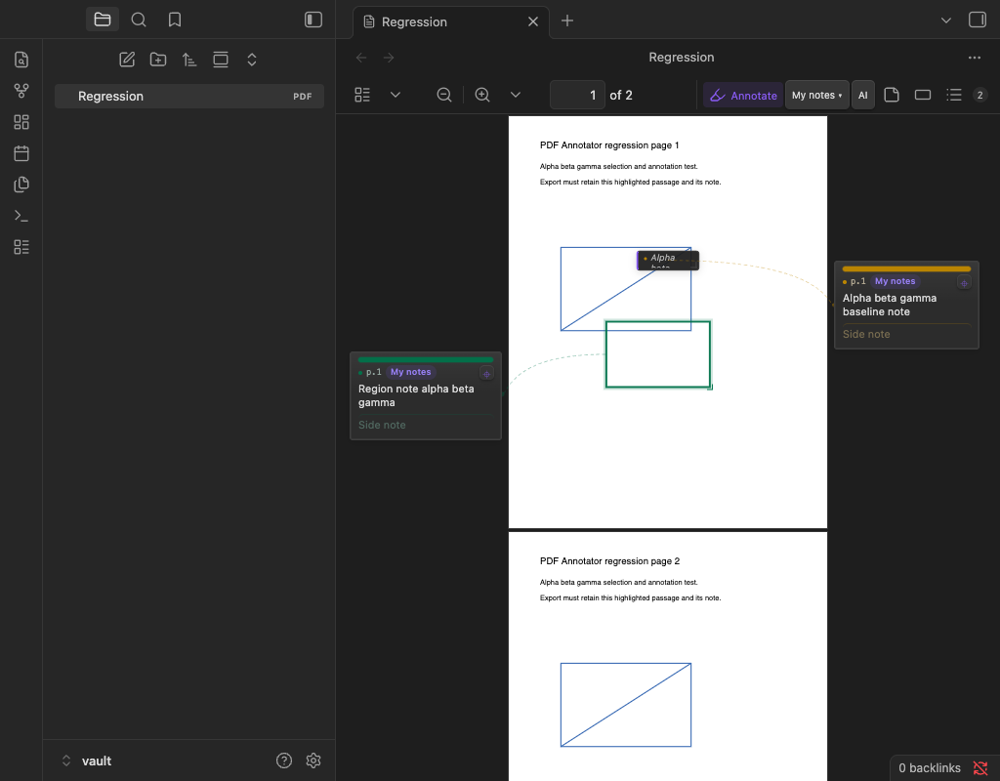
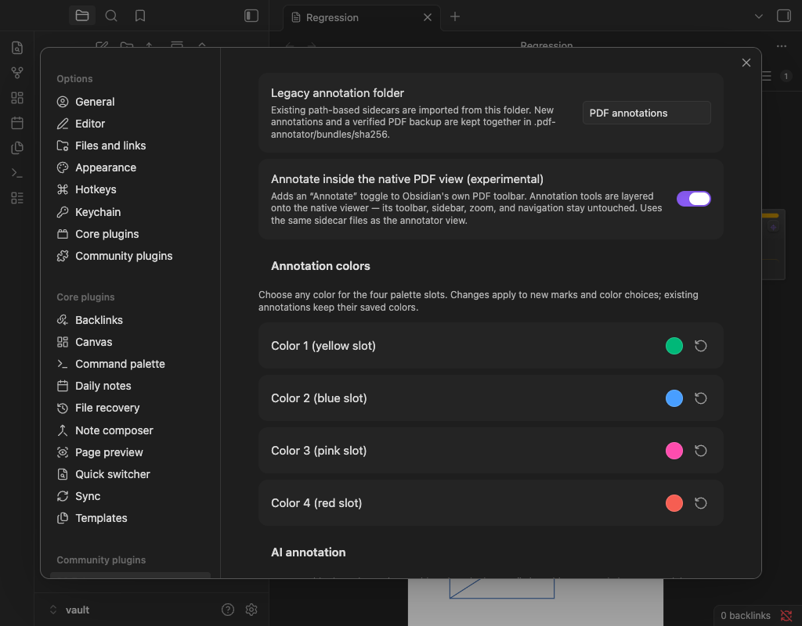

# 0.4.0 verification — 2026-10-02

The release was tested in a separate Obsidian profile and synthetic test vault on macOS. The personal vault and the original development checkout were not modified. Actual UI testing used Obsidian 1.11.5; the declared minimum 1.4.0 and other operating systems were not runtime-tested.

## Reproduced and fixed

- **Issue #8:** with 0.3.4, selecting `beta` in `Alpha beta gamma baseline note` then dispatching the card double-click moved both selection endpoints to 30. With the candidate, endpoints remain 6 and 10. Real mouse double-clicks also selected `beta` in both PDF viewers.
- **Markdown focus transfer:** editing one note and explicitly opening another unpinned tag left the old editor focused and the target card absent. The fixed build creates and focuses the requested card while passive refreshes preserve the current edit.
- **Rapid zoom:** three immediate zoom-out clicks left visible bundled-view pages with no canvas or text layer. The fixed build renders the latest scale after the cancelled render settles. Unit coverage exercises cancellation at four asynchronous stages, including hidden, replaced, and closed documents.

## Automated checks run

- `npm ci` from the committed lockfile, followed by `npm test` and `npm run build`: passed.
- `npm run typecheck`: passed.
- `git diff --check`: passed.
- `LPA_BOOK_FIXTURE=<synthetic 30-page PDF> npm run test:book-two-sets`: passed on pages 20–29, with temporary files. The first invocation without a fixture correctly stopped; it was rerun with the generated fixture. Node PDF.js emitted optional canvas/font-data warnings; this test exercises extraction and persistence, while actual rendering was checked in Obsidian.
- Ordinary tests cover annotation storage, multi-set visibility/export, bundle identity/recovery, safe export escaping, gestures, region creation/navigation, palette validation/reset, Markdown source paths/render races/lifecycle, AI request contracts and credentials (without provider calls), and the new selection/focus/zoom regressions.

## Actual Obsidian checks run

- Four native color inputs; change, save, plugin reload, full app reload, per-slot reset, and duplicate-colored slots retaining independent selection. Existing marks keep their stored colors.
- Region creation from both toolbars, outline-to-card association, real native-view pointer drag and free resize, transparent click-through interior, saved note/pin/set identity, zoom, reopening, and Escape cancellation during a real drag.
- Markdown default off, setting on/off, bold, fenced code, inline and display MathJax, side-note rendering, clicking preview to edit the original source, autosave, and returning to preview. A script/event-handler fixture was removed by Obsidian's renderer and did not execute.
- Existing bundled-view PDF text selection by real mouse drag, hover-to-open selection actions, configured swatches, and saving a highlight with quote/geometry/color.
- Real vault export retains the complete highlighted passage, its custom color, and separate user commentary. This reconfirms the fix originally released in 0.3.2 for issue #3.
- Explicit plugin disable/enable after replacing assets, then full Obsidian reload. The final installed `main.js` hash matched the clean build, and the reload read manifest version 0.4.0.

## Contribution and compatibility review

PR #7 by Moritz von Büren was incorporated with attribution, with additional selection, lifecycle, and focus-transfer fixes. Markdown remains opt-in and stored note text is unchanged. PR #2 was reviewed but not merged wholesale: its large viewer rewrite, variable palette size, export templates, and export-path changes were not adopted. Its earlier export ideas remain acknowledged; palette customization here is a focused implementation for the existing four slots.

Existing annotations remain version-1 documents. Regions use the existing tag geometry and an optional `tagStyle` field; ordinary tags and highlights keep their prior behavior. Exports and existing palette interpretation are unchanged.

## Dependency audit and limits

`npm audit` is **not clean**: it reports six existing dependency advisories (two moderate, three high, one critical). The Node-only optional canvas installation chain accounts for tar/node-pre-gyp/brace-expansion findings; Obsidian's development typings dependency accounts for moment/obsidian findings. These dependencies are not shipped in the three release assets. The pinned PDF.js advisory concerns its eval path; this repository's existing build disables eval feature detection and removes dynamic code generation from both API and worker. The resulting bundle was checked for the forbidden eval/Function tokens and Node-only imports. This matches the [documented PDF.js workaround](https://github.com/advisories/GHSA-wgrm-67xf-hhpq). Dependency versions were not changed as part of this release.

No paid live-AI integration test was run. Tests do not constitute a complete security audit, and other Obsidian versions/platforms remain outside the runtime evidence above. GitHub had no configured workflows, branch protection, or branch rules requiring CI at verification time.
